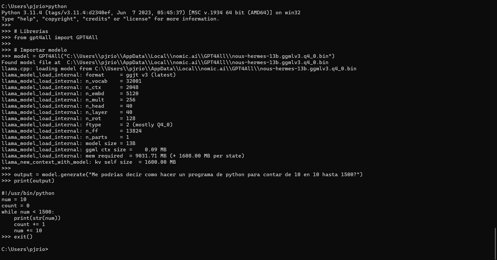
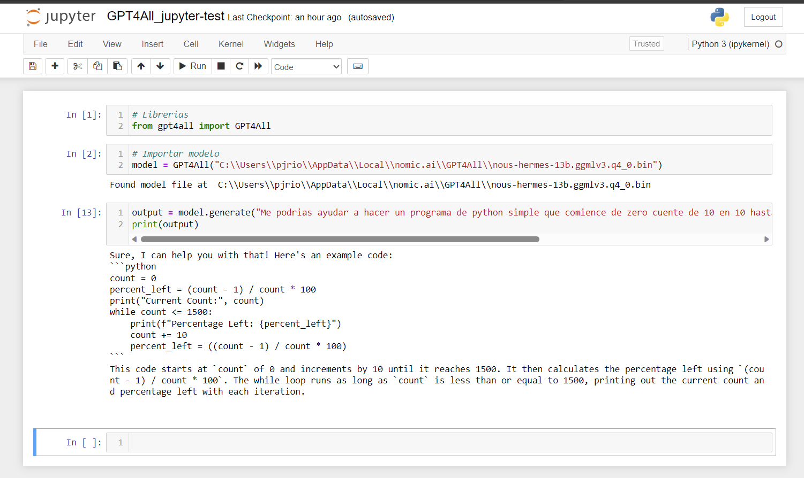

## Diferentes Formas de Ejecutar Código de Python

Python, como lenguaje de programación versátil, ofrece diversas formas de ejecutar y probar código. Cada enfoque tiene sus propias ventajas y desafíos, adaptándose a diferentes situaciones y necesidades. A continuación, exploraremos tres maneras comunes de ejecutar código de Python:

**`Nota:`** Cada enfoque tiene su lugar en el proceso de desarrollo de Python, y la elección depende de la naturaleza del proyecto, la preferencia personal y las herramientas disponibles. Experimenta con estas diferentes formas para encontrar la que mejor se adapte a tu flujo de trabajo y requisitos específicos.

### 1. **Interpretación Interactiva:**

Python proporciona un intérprete interactivo que te permite ejecutar código línea por línea en tiempo real. Puedes acceder a él abriendo una terminal y escribiendo `python`.

**Ventajas:**
- Ideal para probar pequeñas piezas de código y experimentar.
- Proporciona un entorno interactivo para explorar bibliotecas y funciones.

**Desafíos:**
- No es ideal para ejecutar scripts largos o proyectos completos.
- La falta de persistencia puede dificultar la reutilización de código.

      

### 2. **Scripts Independientes:**

Crear scripts de Python en archivos con extensión `.py` es una manera común de escribir y ejecutar código. Puedes editar estos scripts con cualquier editor de texto y luego ejecutarlos desde la terminal con `python nombre_del_script.py`.

**Ventajas:**
- Permite crear programas completos y reutilizables.
- Ideal para automatizar tareas y proyectos más grandes.
- Mayor control y estructura en comparación con la interpretación interactiva.

**Desafíos:**
- Puede requerir la instalación de dependencias y la gestión manual de entornos virtuales.

  

      
  

### 3. **Entornos de Desarrollo Integrados (IDEs):**

Los IDEs, como PyCharm, Visual Studio Code y Jupyter Notebook, ofrecen entornos completos para escribir, depurar y ejecutar código de Python. Proporcionan funciones avanzadas como resaltado de sintaxis, depuración visual y gestión de paquetes.

**Ventajas:**
- Proporciona un flujo de trabajo eficiente para proyectos complejos.
- Facilita la depuración y el perfilado del código.
- Integración con herramientas de control de versiones y otros recursos.

**Desafíos:**
- Puede requerir más recursos de sistema en comparación con los métodos anteriores.
- Puede tener una curva de aprendizaje inicial para aprovechar todas las características.

  

      
  

