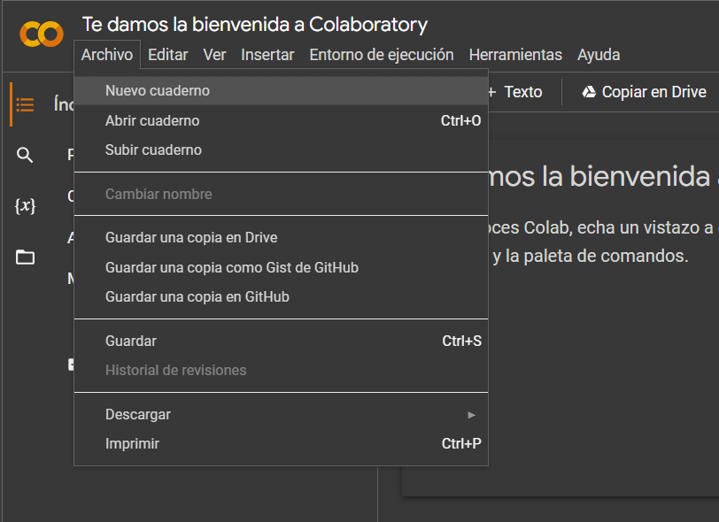
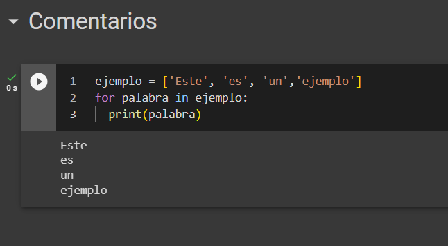

<h2>Cómo Usar Google Colab</h2>

1. **Acceso a Google Colab:** Abre tu navegador web y visita [Google Colab](https://colab.research.google.com/?hl=es).
  

      
  

3. **Iniciar Sesión:** Si no has iniciado sesión con tu cuenta de Google, hazlo haciendo clic en el botón "Sign In" (Iniciar sesión) en la esquina superior derecha.

4. **Crear un Nuevo Cuaderno:** Una vez que hayas iniciado sesión, puedes crear un nuevo cuaderno haciendo clic en "New Notebook" (Nuevo cuaderno) en la página de inicio.
  

      
  

6. **Celdas de Código y Texto:** Google Colab utiliza celdas para organizar tu código y texto. Puedes añadir una nueva celda haciendo clic en el botón "+ Code" (Código) o "+ Text" (Texto) en la barra superior.
   
  

      
  

7. **Escribir Código:** En una celda de código, puedes escribir código en lenguaje Python. Para ejecutar el código en una celda, presiona Shift + Enter o haz clic en el botón "Play" (Reproducir) que aparece a la izquierda de la celda.
  

     |
    
  

9. **Agregar Comentarios:** Utiliza celdas de texto para agregar explicaciones, documentación o comentarios a tu cuaderno. Puedes usar formato Markdown para dar formato al texto.

10. **Ejecutar Celdas en Orden:** Es importante ejecutar las celdas en orden, ya que las variables y resultados de celdas anteriores estarán disponibles en celdas posteriores.

11. **Instalar Bibliotecas:** Puedes instalar bibliotecas Python adicionales directamente en Google Colab utilizando comandos como `!pip install nombre_de_la_biblioteca`.
  

      
  

13. **Guardar y Compartir:** Puedes guardar tu cuaderno en Google Drive haciendo clic en "File" (Archivo) > "Save" (Guardar). También puedes compartir el cuaderno con otras personas permitiéndoles ver o editar.

14. **Acceso a Recursos de Google:** Google Colab ofrece acceso a recursos como GPUs y TPUs de forma gratuita, lo que puede acelerar el procesamiento de tus cálculos y modelos de aprendizaje automático.

15. **Ejecución Remota:** Si necesitas ejecutar tu código durante un período prolongado (por ejemplo, entrenamiento de modelos de aprendizaje automático), puedes mantener la sesión activa y ejecutarlo en los servidores de Google.

16. **Descargar y Subir Archivos:** Puedes descargar archivos generados en tu cuaderno o cargar archivos desde tu sistema local para su procesamiento en Google Colab.

17. **Exportar a Diferentes Formatos:** Puedes exportar tu cuaderno en diferentes formatos, como HTML o PDF, para compartirlo fácilmente.

Google Colab es una herramienta poderosa para trabajar con Python en la nube sin necesidad de configurar entornos locales. Te permite acceder a recursos computacionales y colaborar con otros de manera eficiente. ¡Espero que esta guía te sea útil para comenzar con Google Colab! 
